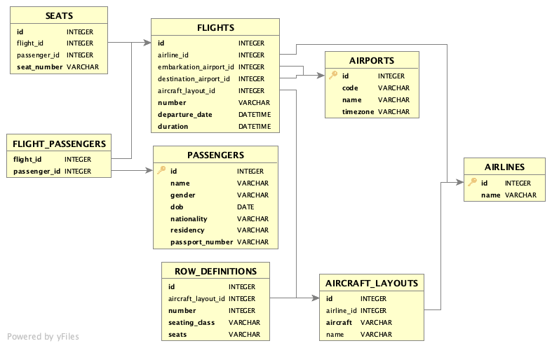

Database Schema and Database Creation
=====================================

The flight booking application has a SQLite back-end with the following schema:

+-------------------+---------------------------------------------------------------------------------------+
| Table             | Comments                                                                              |
+-------------------+---------------------------------------------------------------------------------------+
| AIRPORTS          | Airport definitions                                                                   |
+-------------------+---------------------------------------------------------------------------------------+
| AIRLINES          | Airline definitions                                                                   |
+-------------------+---------------------------------------------------------------------------------------+
| PASSENGERS        | Passenger details                                                                     |
+-------------------+---------------------------------------------------------------------------------------+
| FLIGHTS           | Flight details                                                                        |
+-------------------+---------------------------------------------------------------------------------------+
| FLIGHT_PASSENGERS | Many-to-many relationships table between flights and passengers                       |
+-------------------+---------------------------------------------------------------------------------------+
| AIRCRAFT_LAYOUTS  | Container for the row definitions defining the physical seating layout of an aircraft |
+-------------------+---------------------------------------------------------------------------------------+
| ROW_DEFINITIONS   | Row definition defining the seating layout for a numbered row in an aircraft          |
+-------------------+---------------------------------------------------------------------------------------+
| SEATS             | Seats on a flight that can be allocated to passengers                                 |
+-------------------+---------------------------------------------------------------------------------------+

To (re)create the SQLite database file, run the flight_module.model package at the console:

::

    python -m flight_module.model

The existing database file will be deleted, if present, and a new one created with an up-to-date model. It will also
be populated with sample airport, airline, aircraft, flight and passenger data.
